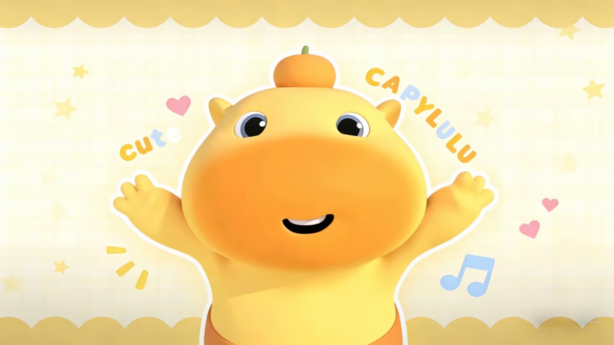

<html lang="zh-CN">
<head>
  <meta charset="utf-8" />
  <meta name="viewport" content="width=device-width,initial-scale=1" />
  <title>Nacy · 赛博世界</title>

  <!-- Google Fonts -->
  <link href="https://fonts.googleapis.com/css2?family=Poppins:wght@300;400;600;700&family=Great+Vibes&display=swap" rel="stylesheet">

  
</head>
<body>
  <header class="topbar">
    

      

        

          <svg viewBox="0 0 24 24" width="24" height="24" fill="none" aria-hidden="true">
            <defs><linearGradient id="g" x1="0" x2="1"><stop offset="0" stop-color="#fff"/><stop offset="1" stop-color="#FFD8F0"/></linearGradient></defs>
            <path d="M12 3c1.8 2 4 2.5 6 3-1.6 1.6-2 4-1.8 6.2C14.6 11.8 9.8 11.4 7 14c-2-2 .5-6 5-11z" fill="url(#g)" opacity="0.95"/>
          </svg>
        

        

          
Nacy的赛博世界

          
个人网站

        

      

      <nav class="topnav" aria-label="主菜单">
        <a href="#about" data-target="about">关于</a>
        <a href="#skills" data-target="skills">技能</a>
        <a href="#logs" data-target="logs">日志</a>
        <a href="#contact" data-target="contact">联系</a>
        <a class="cta enchanted" href="#logs" data-target="logs">查看日志</a>
      </nav>
    

  </header>

  <!-- fullpage 容器：每个主要区块作为一页（.page） -->
  <main id="fullpage" tabindex="0" aria-label="整页导航容器">
    <!-- Hero = Page 0 -->
    <section class="page hero" id="hero" aria-labelledby="hero-h">
      

        

          
作者Nacy

          <h1 class="hero-title" id="hero-h">欢迎来到 <small style="font-weight:500;color:#6b5b79">我的赛博世界</small></h1>
          
本站建于2026/7/27。

          

            <button class="btn enchanted" onclick="goToPageIndex(2)">查看日志</button>
            <button class="btn secondary enchanted" onclick="goToPageIndex(4)">留言联系</button>
          

          

            <svg width="18" height="18" viewBox="0 0 24 24" fill="none" style="filter:drop-shadow(0 4px 8px rgba(200,150,220,0.08));">
              <path d="M12 2l2.5 6H22l-5 3.8L18.8 22 12 17.8 5.2 22 7 11.8 2 8h7.5L12 2z" fill="#FFF0F8" opacity="0.95"/>
            </svg>
            日志记录
          

        

        

          

            

            

            

              <svg viewBox="0 0 640 420" xmlns="http://www.w3.org/2000/svg" preserveAspectRatio="xMidYMid meet">
                <defs>
                  <linearGradient id="gSky" x1="0" x2="1"><stop offset="0" stop-color="#E9F6FF"/><stop offset="1" stop-color="#F9EEFF"/></linearGradient>
                </defs>
                <rect x="0" y="0" width="640" height="420" rx="24" fill="url(#gSky)" opacity="0.0"/>
              </svg>
            

            

              <svg viewBox="0 0 200 200" xmlns="http://www.w3.org/2000/svg">
                <defs><linearGradient id="c1" x1="0" x2="1"><stop offset="0" stop-color="#FFEFF8"/><stop offset="1" stop-color="#E7F7FF"/></linearGradient></defs>
              </svg>
            

            

              <svg viewBox="0 0 200 200" xmlns="http://www.w3.org/2000/svg"></svg>
            

          

        

      

    </section>

    <!-- About = Page 1 -->
    <section class="page" id="about" aria-labelledby="about-h">
      

        

          

            
          

          

            <h3 id="about-h">你好，我是Nacy。</h3>
            
物种：智人（Homo Sapiens)

            
活跃时期：白天

            
技术依赖：每天触摸玻璃屏幕超过6小时

            
日常消耗：每日约2000千卡食物

            

              
活着

              
吃饭

              
呼吸

              
睡觉

              
不思考

            

          

        

      

    </section>

    <!-- Skills = Page 2 -->
    <section class="page" id="skills" aria-labelledby="skills-h">
      

        <h3 id="skills-h" style="margin-bottom:18px">日志目录</h3>
        

          

            <h4>第一章：千年之后</h4>
            
千年之后，如果人类文明还存在。

            
<i style="width:92%"></i>

          

          

            <h4>第二章：我的思考</h4>
            
基于宇宙大爆炸对活着意义的思考和论证。

            
<i style="width:86%"></i>

          

          

            <h4>第三章：围棋。</h4>
            
下围棋，但赢不了AI。

            
<i style="width:88%"></i>

          

        

      

    </section>

    <!-- Logs = Page 3 -->
    <section class="page" id="logs" aria-labelledby="logs-h">
      

        <h3 id="logs-h" style="margin-bottom:18px">赛博日志</h3>

        

          <!-- log entries (unchanged) -->
          <article class="log-entry" aria-labelledby="log-1-title">
            

              
2026-07-27

              

                千年之后
                人类文明
              

            

            

              <h4 id="log-1-title" class="log-title">给千年后读到这段文字的你</h4>
              
如果你正在读这段文字，说明Github存储的代码库已经过了一千年。不管你是人类、AI，还是其他什么存在--你好。

              

                <button class="btn" onclick="openLog(1)">阅读全文</button>
                
阅读需 2 分钟

              

            

            

              <svg width="100%" height="100%" viewBox="0 0 160 110" preserveAspectRatio="xMidYMid meet" xmlns="http://www.w3.org/2000/svg">
                <defs><linearGradient id="lg1" x1="0" x2="1"><stop offset="0" stop-color="#FDEFF8"/><stop offset="1" stop-color="#E8F6FF"/></linearGradient></defs>
                <rect width="100%" height="100%" rx="8" fill="url(#lg1)"/>
                <text x="50%" y="52%" font-family="Poppins,Arial" font-size="12" fill="#6b5b79" text-anchor="middle">暮光城堡 · 练习图</text>
              </svg>
            

          </article>

          <article class="log-entry" aria-labelledby="log-2-title">
            

              
2026-06-04

              

                思考
                宇宙
              

            

            

              <h4 id="log-2-title" class="log-title">基于宇宙大爆炸对活着意义的思考和论证</h4>
              
记录了在 CSS 与少量 JS 中实现星光 twinkle、鼠标视差与卡片悬浮光影的实现思路与性能优化要点。

              

                <button class="btn" onclick="openLog(2)">阅读全文</button>
                
阅读需 3 分钟

              

            

            

              <svg width="100%" height="100%" viewBox="0 0 160 110" preserveAspectRatio="xMidYMid meet" xmlns="http://www.w3.org/2000/svg">
                <rect width="100%" height="100%" rx="8" fill="#FFF8F5"/>
                <text x="50%" y="52%" font-family="Poppins,Arial" font-size="12" fill="#6b5b79" text-anchor="middle">交互笔记</text>
              </svg>
            

          </article>

          <article class="log-entry" aria-labelledby="log-3-title">
            

              
2026-07-10

              

                围棋
                时光
              

            

            

              <h4 id="log-3-title" class="log-title">围棋</h4>
              
下围棋，但赢不了AI。

              

                <button class="btn" onclick="openLog(3)">阅读全文</button>
                
阅读需 4 分钟

              

            

            

              <svg width="100%" height="100%" viewBox="0 0 160 110" preserveAspectRatio="xMidYMid meet" xmlns="http://www.w3.org/2000/svg">
                <rect width="100%" height="100%" rx="8" fill="#FFF4FF"/>
                <text x="50%" y="52%" font-family="Poppins,Arial" font-size="12" fill="#6b5b79" text-anchor="middle">角色草稿</text>
              </svg>
            

          </article>

        

        <!-- modal same as before -->
        

          

            <button onclick="closeLog()" aria-label="关闭" style="position:absolute;right:14px;top:14px;border:none;background:transparent;font-weight:700;color:#5a3f65;cursor:pointer">✕</button>
            <h3 id="modalTitle" style="margin-top:6px;color:#3b2b4a"></h3>
            

            

          

        

      

    </section>

    <!-- Contact = Page 4 -->
    <section class="page" id="contact" aria-labelledby="contact-h">
      

        <h3 id="contact-h" style="margin-bottom:18px">留言与评论</h3>
        

          

            <form id="contactForm" onsubmit="submitForm(event)">
              

                
<label class="visually-hidden">姓名</label><input type="text" id="name" placeholder="你的名字（必填）" required>

                
<label class="visually-hidden">邮箱</label><input type="email" id="email" placeholder="邮箱（必填）" required>

              

              

                <textarea id="message" placeholder="写下你的需求/留言，我会在 1-2 个工作日内回复 😊" required></textarea>
              

              

                <button class="btn" type="submit">发送消息</button>
                
或发送邮件：<strong style="color:#5a3f65">lhylucy9816@163.com</strong>

              

            </form>
          

          

            

              <h4 style="margin-top:0">联系方式</h4>
              
位于：猎户座-M42

              
期待你的来信。

              

                
Figma

SVG 动效

CSS / JS

              

            

          

        

      

    </section>

    <!-- Footer = Page 5 -->
    <section class="page" id="footerPage" aria-labelledby="footer-h">
      

        <footer>
          

            

              

                
Nacy的赛博世界

                
© 2026 Cahad — 所有内容归作者所有

              

              

                <a href="#" aria-label="微博" title="微博" style="color:var(--muted)">微博</a>
                <a href="#" aria-label="Dribbble" title="Dribbble" style="color:var(--muted)">Nacy</a>
                <a href="#" aria-label="邮箱" title="邮箱" style="color:var(--muted)">邮箱</a>
              

            

          

        </footer>
      

    </section>

  </main>

  
消息已发送，感谢你的联系 ✨

  
</body>
</html>
